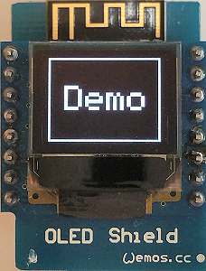
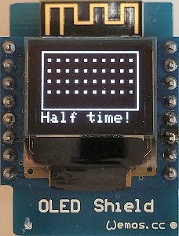

# D1 mini: Klasse f&uuml;r 0,66" OLED
Version 2018-12-15   
[English version](./oled_classes_README.md "English version")   

Die Klasse `Screen1` dient zur Anzeige von Text auf einem 0,66" gro&szlig;en OLED Shield f&uuml;r den D1 mini. Es k&ouml;nnen maximal 6 Zeilen mit 10 Zeichen dargestellt werden.   
Das Display basiert auf dem SSD1306, hat eine Aufl&ouml;sung von 64x48 Pixel und wird &uuml;ber den I2C-Bus angesteuert (7bit-Adresse 0x3C bzw. 0x3D).   
Der Programmcode basiert weitgehend auf den Adafruit-Bibliotheken
* _Adafruit_SSD1306-esp8266-64x48.zip
* Adafruit-GFX-Library-1.1.5.zip   

und ist speziell auf das OLED-Shield f&uuml;r den D1 mini zugeschnitten. Zus&auml;tzlich zur Textausgabe k&ouml;nnen mit dieser Klasse auch Grafiken gezeichnet und Basisfunktionen des Displays ausgef&uuml;hrt werden.

## Verwendung
Um die Klasse `Screen1` zu verwenden, m&uuml;ssen lediglich folgende vier Dateien in das aktuelle Arbeitsverzeichnis oder in das src-Verzeichnis kopiert werden:   
`D1_class_Screen_64x48.h`, `D1_class_Screen_64x48.cpp`, `D1_class_Screen1.h` und `D1_class_Screen1.cpp`   
NEU: Dateien mit Scroll-Funktion:   
`D1_class_Screen_64x48.h`, `D1_class_Screen_64x48.cpp`, `D1_class_Screen1a.h` und `D1_class_Screen1a.cpp`   

## Vorgefertigte Bildschirm-Layouts
### Bildschirm-Namen
Bildschirm-Namen bestehen aus dem Wort `screen` gefolgt von der Anzahl an Textzeilen bei diesem Bildschirm (6, 5, 4, 4B, 2, 1 oder Kombinationen wie 221, 112, 13 12).    
H&auml;ngt man an den Namen ein `i` an, so wird die entsprechende Zeile invertiert dargestellt (schwarz auf wei&szlig;).   
H&auml;ngt man an den Namen ein `Clear` an, so wird der Bildschirm vor der Textausgabe gel&ouml;scht.   

**Parameter**   
* line_ .... Zeilennummer, in die der Text geschrieben wird (1 bis 6 = Zeile 6)
* text_ .... Text, der geschrieben werden soll (max. 10 Zeichen pro Zeile, 5 Zeichen bei doppelt gro&szlig;en Zeichen)
* align_ ... Textausrichtung (Vorgabe: 'l'=linksb&uuml;ndig, Zeile wird vorher gel&ouml;scht. 'c'=zentriert, 'r'=rechtsb&uuml;ndig, 'L'=linksb&uuml;ndig+Zeichen &uuml;berschreiben, C'=zentriert+Zeichen &uuml;berschreiben, 'R'=rechtsb&uuml;ndig+Zeichen &uuml;berschreiben)   

_Beispiele_
* `screen6iClear(1,"Demo",'c');`  ..... L&ouml;schen des Bildschirms, schreiben des Textes "Demo" invertiert und zentriert in die Zeile 1 des sechszeiligen Bildschirms.
* `screen6(3,"Demo for",'l');`  ..... Schreiben des Textes "Demo for" linksb&uuml;ndig in Zeile 3 des Bildschirms mit 6 Zeilen.

### Scrollen
Die Bildschirme _screen6_, _screen5_, _screen4_ und _screen4B_ der Dateien `D1_class_Screen1a.h` und `D1_class_Screen1a.cpp` erm&ouml;glichen das Scrollen eines Textes. Dazu wird der Text in die n&auml;chste, nicht sichtbare Zeile geschrieben. (ZB bei screen6: Zeile 7 usw.)

### Bildschirmbilder
**Einfache Bildschirme (Screens): ein Bereich, 4 bis 6 Zeilen mit einfach hohen Zeichen**    

   

   

**Einfache Bildschirme (Screens): ein Bereich, 1 bis 2 Zeilen mit doppelt hohen Zeichen**   

**Bildschirme mit mehr als einem Bereich, einfach hohe Zeichen**      

**Bildschirme mit einfach und doppelt hohen Zeichen**      

   

**Bildschirme mit zwei Symbolen f&uuml;r zwei Taster**      

**Spezielle Bildschirme**   

**Grafikbeispiel**   

## Klassendiagramm Screen1

| Klasse Screen1               | erweitert _Adafruit_SSD1306, _Adafruit_GFX, Print    |
| ---------------------------- | ---------------------------------------------------- |
| + Screen1()                  | Vorgabekonstruktor, setzt OLED_RESET auf D3(=GPIO0), ruft setup() auf |
| + Screen1(int oled_resetpin) | Konstruktor, setzt OLED reset Pin, ruft setup() auf |
| ~ void setup(int pin_num)    | Eigenschaften setzen (I2C Adresse, Zeichensatz (font), Textfarbe, Textgr&ouml;&szlig;e, dotCounter)            |

&nbsp;

| Einfache Bildschirme: ein Bereich, 4 bis 6 Zeilen, einfach hohen Zeichen |                                                      |
| ------------------------------------------------------------------------ | ---------------------------------------------------- |
| + void screen6 (int line_, String text_)                    | Schreibe Text in Zeile 1...6, Text linksb&uuml;ndig, kein Rahmen  |
| + void screen6 (int line_, String text_, char align_)       | Schreibe Text in Zeile 1...6, angegebene Textausrichtung, kein Rahmen |
| + void screen6Clear (int line_, String text_)               | Bildschirm l&ouml;schen, schreibe Text in Zeile 1...6, Text linksb&uuml;ndig, kein Rahmen  |
| + void screen6Clear (int line_, String text_, char align_)  | Bildschirm l&ouml;schen, schreibe Text in Zeile 1...6, angegebene Textausrichtung, kein Rahmen |
| 
 | 
 |
| + void screen5 (int line_, String text_)                    | Schreibe Text in Zeile 1...5, Text linksb&uuml;ndig, Rahmen  |
| + void screen5 (int line_, String text_, char align_)       | Schreibe Text in Zeile 1...5, angegebene Textausrichtung, Rahmen |
| + void screen5Clear (int line_, String text_)               | Bildschirm l&ouml;schen, schreibe Text in Zeile 1...5, Text linksb&uuml;ndig, Rahmen  |
| + void screen5Clear(int line_, String text_, char align_)   | Bildschirm l&ouml;schen, schreibe Text in Zeile 1...5, angegebene Textausrichtung, Rahmen |
| 
 | 
 |
| + void screen4 (int line_, String text_)                    | Schreibe Text in Zeile 1...4, Text linksb&uuml;ndig, Rahmen  |
| + void screen4 (int line_, String text_, char align_)       | Schreibe Text in Zeile 1...4, angegebene Textausrichtung, Rahmen |
| + void screen4Clear (int line_, String text_)               | Bildschirm l&ouml;schen, schreibe Text in Zeile 1...4, Text linksb&uuml;ndig, Rahmen  |
| + void screen4Clear (int line_, String text_, char align_)  | Bildschirm l&ouml;schen, schreibe Text in Zeile 1...4, angegebene Textausrichtung, Rahmen |

__*Beachte*__: Bildschime mit i (wie screen6i, screen5i, screen4i) machen das gleiche, aber **invertieren** den Text in der angegebenen Zeile. Die Vorgabe f&uuml;r die Textausrichtung ist **zentriert**!

&nbsp;

| Einfache Bildschirme: ein Bereich, 1 bis 2 Zeilen, doppelt hohen Zeichen |       |
| ------------------------------------------------------------------------ | ----- |
| + void screen2 (int line_, String text_)                         | Schreibe Text in Zeile 1...2 (big, Rahmen), Text linksb&uuml;ndig  |
| + void screen2 (int line_, String text_, char align_)            | Schreibe Text in Zeile 1...2 (big, Rahmen), angegebene Textausrichtung |
| + void screen2Clear(int line_, String text_, char align_)        | Bildschirm l&ouml;schen, Schreibe Text in Zeile 1...2 (big, Rahmen), angegebene Textausrichtung |
| + void screen1 (String text_)                                    | Schreibe Text in Zeile 1 (big, Rahmen), Text mittenzentiert        |
| + void screen1 (String text_, char align_)                       | Schreibe Text in Zeile 1 (big, Rahmen), angegebene Textausrichtung |
| + void screen1Clear(String text_, char align_)                   | Bildschirm l&ouml;schen, schreibe Text in Zeile 1...2 (big, Rahmen), angegebene Textausrichtung |

&nbsp;

| Bildschirme mit mehr als einem Bereich, einfach hohe Zeichen |       |
| ------------------------------------------------------------ | ----- |
| <nobr>+ void screen221(int line_,String text_, char align_, bool cls_)</nobr> | Schreibe Text in Zeile 1...5, angegebene Textausrichtung, Rahmen 1+2 und 3+4, Bildschirm l&ouml;schen |
| + void screen221(int line_,String text_)                         | Schreibe Text in Zeile 1...5, Text linksb&uuml;ndig,  Rahmen um Zeile 1+2 und 3+4 |
| + void screen221(int line_,String text_, char align_)            | Schreibe Text in Zeile 1...5, angegebene Textausrichtung, Rahmen um Zeile 1+2 und 3+4 |
| + void screen221Clear(int line_,String text_, char align_)       | Bildschirm l&ouml;schen, schreibe Text in Zeile 1...5, angegebene Textausrichtung, Rahmen um Zeile 1+2 und 3+4 |

&nbsp;

| Bildschirme mit einfach und doppelt hohen Zeichen |                  |
| ------------------------------------------------- | ---------------- |
| <nobr>+ void screen112(int line_,String text_, char align_, bool cls_)</nobr> | Schreibe Text in Zeile 1...4 (Zeile 1 invertiert, line 2 big), Text linksb&uuml;ndig, Rahmen, Bildschirm l&ouml;schen |
| + void screen112(int line_,String text_)                         | Schreibe Text in Zeile 1...4 (Zeile 1 invertiert, line 2 big), Text linksb&uuml;ndig, Rahmen  |
| + void screen112(int line_,String text_, char align_)            | Schreibe Text in Zeile 1...4 (Zeile 1 invertiert, line 2 big), angegebene Textausrichtung, Rahmen  |
| + void screen112Clear(int line_,String text_, char align_)       | Bildschirm l&ouml;schen, schreibe Text in Zeile 1...4 (Zeile 1 invertiert, line 2 big), angegebene Textausrichtung, Rahmen  |
| 
 | 
 | 
| + void screen13(int line_, String text_, char align_, bool cls_) | Schreibe Text in Zeile 1...4 (Zeile 1 doppelt hoch, Rahmen), angegebene Textausrichtung, Bildschirm l&ouml;schen |
| + void screen13(int line_, String text_)                         | Schreibe Text in Zeile 1...4 (Zeile 1 doppelt hoch, Rahmen), Text linksb&uuml;ndig  |
| + void screen13(int line_, String text_, char align_)            | Schreibe Text in Zeile 1...4 (Zeile 1 doppelt hoch, Rahmen), angegebene Textausrichtung |
| + void screen13Clear(int line_, String text_, char align_)       | Bildschirm l&ouml;schen, schreibe Text in Zeile 1...4 (Zeile 1 doppelt hoch, Rahmen), angegebene Textausrichtung |
| 
 | 
 |
| + void screen12(int line_, String text_, char align_, bool cls_) | Schreibe Text in Zeile 1...3 (Zeile 1 doppelt hoch, Rahmen), angegebene Textausrichtung, Bildschirm l&ouml;schen |
| + void screen12(int line_, String text_)                         | Schreibe Text in Zeile 1...3 (Zeile 1 doppelt hoch, Rahmen), Text linksb&uuml;ndig  |
| + void screen12(int line_, String text_, char align_)            | Schreibe Text in Zeile 1...3 (Zeile 1 doppelt hoch, Rahmen), angegebene Textausrichtung |
| + void screen12Clear(int line_, String text_, char align_)       | Bildschirm l&ouml;schen, schreibe Text in Zeile 1...3 (Zeile 1 doppelt hoch, Rahmen), angegebene Textausrichtung |

&nbsp;

| Bildschirme mit zwei Symbolen f&uuml;r zwei Taster |                  |
| -------------------------------------------------- | ---------------- |   
| + void screen4B (int line_, String text_)                    | Schreibe Text in Zeile 1...6, Text linksb&uuml;ndig, Rahmen  |
| + void screen4B (int line_, String text_, char align_)       | Schreibe Text in Zeile 1...6, angegebene Textausrichtung, Rahmen |
| + void screen4BClear (int line_, String text_)               | Bildschirmzeile 1 bis 4 l&ouml;schen, schreibe Text in Zeile 1...6, Text linksb&uuml;ndig, Rahmen  |
| <nobr>+ void screen4BClear (int line_, String text_, char align_)</nobr> | Bildschirmzeile 1 bis 4 l&ouml;schen, schreibe Text in Zeile 1...6, angegebene Textausrichtung, Rahmen |
| + void screen4BClearAll (int line_, String text_)               | Bildschirm l&ouml;schen, schreibe Text in Zeile 1...6, Text linksb&uuml;ndig, Rahmen  |
| <nobr>+ void screen4BClearAll (int line_, String text_, char align_)</nobr> | Bildschirm l&ouml;schen, schreibe Text in Zeile 1...6, angegebene Textausrichtung, Rahmen |

__*Beachte*__: Zeile 5 ist der linke Taster-Text, Zeile 6 ist der rechte Taster-Text. Der Taster-Text darf nur 4 Zeichen lang sein! Ist der Text leer, so wird das Tastersymbol nicht gezeichnet.

&nbsp;

| Spezial-Bildschirme            |                  |
| ------------------------------ | ---------------- |
| + void dotClear(void)          | Bildschirm l&ouml;schen, zeichne Rahmen                           |
| + void dotClear(String line6)  | Bildschirm l&ouml;schen, zeichne Rahmen, schreibe Text in Zeile 6 |
| + void dot(void)               | zeichne einen Punkt, erh&ouml;he dotCounter                       |
| + void dotLine(String line6)   | schreibe Text in Zeile 6                                          |

&nbsp;   

|   Hilfsfunktionen              |                                           |
| ------------------------------ | ----------------------------------------- |
| + String utf8ToOled(String s)  | Wandelt UTF-8 String In Oled ASCII Text um (Umwandlung spezieller deutscher Zeichen wie &auml;, &ouml;, &uuml;, &Auml;, &Ouml;, &Uuml;, &szlig;, ...) |
| ~ String mytrim(int max_, String txt_, char align)                         | Erstelle einen String mit max Zeichen (erg&auml;nze Leerzeichen davor und danach) |
| <nobr>~ void scr6(int line_, String text_, char align_, bool cls_, bool invert_)</nobr> | Display: 1 Bereich, 6 Zeilen, 10 Zeichen pro Zeile, kein Rahmen |
| ~ void scr5(int line_, String text_, char align_, bool cls_, bool invert_) | Display: 1 Bereich, 5 Zeilen, 10 Zeichen pro Zeile, kein Rahmen |
| ~ void scr4(int line_, String text_, char align_, bool cls_, bool invert_) | Display: 1 Bereich, 4 Zeilen, 10 Zeichen pro Zeile, kein Rahmen |
| ~ void screen2 (int line_, String text_, char align_, bool cls_) | Schreibe Text in Zeile 1...2 (big, Rahmen), angegebene Textausrichtung, Bildschirm l&ouml;schen |
| ~ void screen1 (String text_, char align_, bool cls_) | Schreibe Text in Zeile 1 (big, Rahmen), angegebene Textausrichtung, Bildschirm l&ouml;schen |

&nbsp;

|  *Eigenschaften*      |                                            |
| --------------------- | ------------------------------------------ |
| ~ int dotCounter      | Z&auml;hler f&uuml;r  dot screen (0...50)  |
