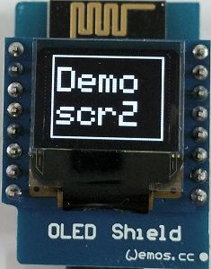
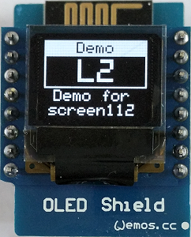

# D1 mini: OLED class
Version 2018-03-03   
[German version](./oled_classes_LIESMICH.md "German version")   

Using the class `Screen1` you can write text easily onto a 0.66" OLED Shield for D1 mini. 6 lines with 10 caracers a possible.   
The Display is based on a SSD1306, has a resolution of 64x48 pixel and is controlled by I2C (7bit-Address 0x3C bzw. 0x3D).   
The code is strongly based on Adafruit libs
* _Adafruit_SSD1306-esp8266-64x48.zip
* Adafruit-GFX-Library-1.1.5.zip   

and is specially written for the D1 mini. You also can draw graphics or execute basic functions of the OLED.

## Usage
To use the class `Screen1`, you just have to copy four files to the working directory:   
`D1_class_Screen_64x48.h`, `D1_class_Screen_64x48.cpp`, `D1_class_Screen1.h` und `D1_class_Screen1.cpp`

## Screens
### screen names
screen names consist of the word `screen` followed by the number of text lines (6, 5, 4, 2, 1 or a combination like 221, 112, 13 12).    
Appending a `i` to the name inverts the line (black on white).   
Appending a `Clear` to the name cleans the display before writing the text.   

Parameters
* line_ .... write text to this line number on oled (1 to 6 = line 6)
* text_ .... text to write (max. 10 chars or 5 big chars)
* align_ ... align of text (default: 'l'=clear line + left, 'c'=center, 'r'=right, 'L'=left + overwrite old text, C'=center+overwrite, 'R'=right+overwrite)

_Examples_
* `screen6iClear(1,"Demo",'c');`  ..... Clear display, then write the text "Demo" inverted in line 1 of a screen with 6 lines.    
* `screen6(3,"Demo for",'l');`  ..... Write the text "Demo for" with aligh left in line 3 of a screen with 6 lines.    

### screen pictures
**Simple screens: one area, 4 to 6 lines, simple high characters**    

   

   

**Simple screens: one area, 1 to 2 lines, double high characters**   

**screens with more than one area, simple high characters**    

**screens with simple and double high characters**    

   

**screens with symbols for buttons**    
**Bildschirme mit zwei Symbolen f&uuml;r zwei Taster**      

**special screens**   

**graphics example**   

## Class diagram Screen1

| class Screen1                  | extends _Adafruit_SSD1306, _Adafruit_GFX, Print                         |
| ------------------------------ | ----------------------------------------------------------------------- |
| + Screen1()                    | default constructor, set OLED_RESET to D3  (=GPIO0), call setup()         |
| + Screen1(int oled_resetpin)   | constructor, set OLED reset pin, call setup()                           |
| ~ void setup(int pin_num)      | setup properties (I2C address, font, text color, text size, dotCounter) |

&nbsp;

| Simple screens: one area, 4..6 single size lines            |               |
| ----------------------------------------------------------- | ------------- |
| + void screen6 (int line_, String text_)                    | write text to line 1...6, text align left, no border  |
| + void screen6 (int line_, String text_, char align_)       | write text to line 1...6, given text align, no border |
| + void screen6Clear (int line_, String text_)               | clear screen, write text to line 1...6, text align left, no border  |
| + void screen6Clear (int line_, String text_, char align_)  | clear screen, write text to line 1...6, given text align, no border |
| 
 | 
 |
| + void screen5 (int line_, String text_)                    | write text to line 1...5, text align left, border  |
| + void screen5 (int line_, String text_, char align_)       | write text to line 1...5, given text align, border |
| + void screen5Clear (int line_, String text_)               | clear screen, write text to line 1...5, text align left, border  |
| + void screen5Clear (int line_, String text_, char align_)  | clear screen, write text to line 1...5, given text align, border |
| 
 | 
 |
| + void screen4 (int line_, String text_)                    | write text to line 1...4, text align left, border  |
| + void screen4 (int line_, String text_, char align_)       | write text to line 1...4, given text align, border |
| + void screen4Clear (int line_, String text_)               | clear screen, write text to line 1...4, text align left, border  |
| + void screen4Clear (int line_, String text_, char align_)  | clear screen, write text to line 1...4, given text align, border |

__*Note*__: Screen names with i (like screen6i, screen5i and screen4i) do the same, but just **invert** the text in the given line. Default align for i-screens is **center**.   
&nbsp;

| simple screens: one area, 1..2 double size lines |       |
| ------------------------------------------------ | ----- |
| + void screen2 (int line_, String text_)                         | write text to line 1...2 (big, border), text align left  |
| + void screen2 (int line_, String text_, char align_)            | write text to line 1...2 (big, border), given text align |
| + void screen2Clear(int line_, String text_, char align_)        | clear screen, write text to line 1...2 (big, border), given text align |
| 
 | 
 |
| + void screen1 (String text_)                                    | write text to line 1 (big, border), text align center    |
| + void screen1 (String text_, char align_)                       | write text to line 1 (big, border), given text align     |
| + void screen1Clear(String text_, char align_)                   | clear screen, write text to line 1 (big, border), given text align |

&nbsp;

| Screens with more than one area, single size lines               |               |
| ---------------------------------------------------------------- | ------------- |
| <nobr>+ void screen221(int line_,String text_, char align_, bool cls_)</nobr> | write text to line 1...5, given text align, border 1+2 and 3+4, clear screen |
| + void screen221(int line_,String text_)                         | write text to line 1...5, text align left,  border 1+2 and 3+4 |
| + void screen221(int line_,String text_, char align_)            | write text to line 1...5, given text align, border 1+2 and 3+4 |
| + void screen221Clear(int line_,String text_, char align_)       | clear screen, write text to line 1...5, given text align, border 1+2 and 3+4 |

&nbsp;

| screens with single and double size lines     |                  |
| --------------------------------------------- | ---------------- |
| <nobr>+ void screen112(int line_,String text_, char align_, bool cls_)</nobr> | write text to line 1...4 (line 1 inverted, line 2 big), text align left, border, clear screen |
| + void screen112(int line_,String text_)                         | write text to line 1...4 (line 1 inverted, line 2 big), text align left, border  |
| + void screen112(int line_,String text_, char align_)            | write text to line 1...4 (line 1 inverted, line 2 big), given text align, border  |
| + void screen112Clear(int line_,String text_, char align_)       | clear screen, write text to line 1...4 (line 1 inverted, line 2 big), given text align, border  |
| 
 | 
 | 
| + void screen13(int line_, String text_, char align_, bool cls_) | write text to line 1...4 (line 1 big, border), given text align, clear screen |
| + void screen13(int line_, String text_)                         | write text to line 1...4 (line 1 big, border), text align left  |
| + void screen13(int line_, String text_, char align_)            | write text to line 1...4 (line 1 big, border), given text align |
| + void screen13Clear(int line_, String text_, char align_)       | clear screen, write text to line 1...4 (line 1 big, border), given text align |
| 
 | 
 |
| + void screen12(int line_, String text_, char align_, bool cls_) | write text to line 1...3 (line 1 big, border), given text align, clear screen |
| + void screen12(int line_, String text_)                         | write text to line 1...3 (line 1 big, border), text align left  |
| + void screen12(int line_, String text_, char align_)            | write text to line 1...3 (line 1 big, border), given text align |
| + void screen12Clear(int line_, String text_, char align_)       | clear screen, write text to line 1...3 (line 1 big, border), given text align |

&nbsp;

| Screens with two button symbols |                  |
| ------------------------------- | ---------------- |
| + void screen4B (int line_, String text_)                    | write text to line 1...6, text align left, border  |
| + void screen4B (int line_, String text_, char align_)       | write text to line 1...6, given text align, border |
| + void screen4BClear (int line_, String text_)               | clear screen, write text to line 1...6, text align left, border  |
| + void screen4BClear (int line_, String text_, char align_)  | clear screen, write text to line 1...6, given text align, border |

__*Notice*__: Line 5 is the left button text, line 6 is the right button text. The button text can only be 4 characters long! If the button text is empty, the button symbol is not shown.

&nbsp;

| special screens                |                  |
| ------------------------------ | ---------------- |
| + void dotClear(void)          | clear screen, draw border                       |
| + void dotClear(String line6)  | clear screen, draw border, write text to line 6 |
| + void dot(void)               | draw a dot, increment dotCounter                |
| + void dotLine(String line6)   | write text to line 6                            |

&nbsp;

| helper functions               |                  |
| ------------------------------ | ---------------- |
| + String utf8ToOled(String s)  | convert a UTF-8 string to oled ASCII text (translate special German characters like &auml;, &ouml;, &uuml;, &Auml;, &Ouml;, &Uuml;, &szlig;, ...) |
| ~ String mytrim(int max_, String txt_, char align)                         | build a string with max chars (add blank before/after) |
| <nobr>~ void scr6(int line_, String text_, char align_, bool cls_, bool invert_)</nobr> | display: 1 area, 6 lines, 10 chars/line, no border |
| ~ void scr5(int line_, String text_, char align_, bool cls_, bool invert_) | display: 1 area, 5 lines, 10 chars/line, no border |
| ~ void scr4(int line_, String text_, char align_, bool cls_, bool invert_) | display: 1 area, 4 lines, 10 chars/line, no border |
| ~ void screen2 (int line_, String text_, char align_, bool cls_) | write text to line 1...2 (big, border), given text align, clear screen |
| ~ void screen1 (String text_, char align_, bool cls_) | write text to line 1 (big, border), given text align, clear screen      |

&nbsp;

|  *properties*         |                                  |
| --------------------- | -------------------------------- |
| ~ int dotCounter      | counter for dot screen (0...50)  |
